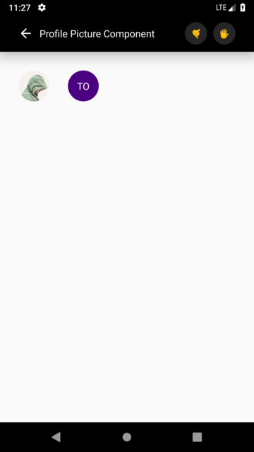

# react-native-profile-picture
Profile picture component for React Native.



## Installation
```
npm install --save react-native-profile-picture
```

## Documentation
| Prop  | Description  | Type  | Default  | Required  |
|---|---|---|---|---|
| isPicture | If it is true, profile picture is shown. If it is false, the first letters of the words in the user name you have given with the user parameter, are shown. | boolean | - | **YES** |
| requirePicture | Picture require. (require('./assets/profilpicture.png')) | number | null | **NO** |
| URLPicture | Picture url. | string | null | **NO** |
| pictureResizeMode | Title of select picker modal. | number | 60 | **NO** |
| user | User name. | string | null | **NO** |
| width | Width of profile picture. | number | 50 | **NO** |
| height | Height of profile picture. | number | 50 | **NO** |
| shape | Shape of profile picture. ('circular', 'rounded') | string | 'circular' | **NO** |
| pictureStyle | Profile picture's style. | object | null | **NO** |
| backgroundColor | Profile picture container's style. (If isPicture is false)  | string | 'indigo' | **NO** |
| userTextColor | User text's color. | string | 'white' | **NO** |
| userTextStyle | User text's style. | string | 'white' | **NO** |
| userContainerStyle | The style of the string consisting of the first letters of the words of the username. | object | null | **NO** |

## Usage
```
// With requirePicture
<ProfilePicture
    isPicture={true}
    requirePicture={require('./assets/avatar.jpg')}
    shape='circle'
/>

// With URLPicture
<ProfilePicture
    isPicture={true}
    requirePicture="http://examplepicturesite.examplecom/picture/profilepicture.png"
    shape='rounded'
/>

// With user name
<ProfilePicture
    isPicture={false}
    user="FirstName ListName"
    shape='rounded'
/>
```
